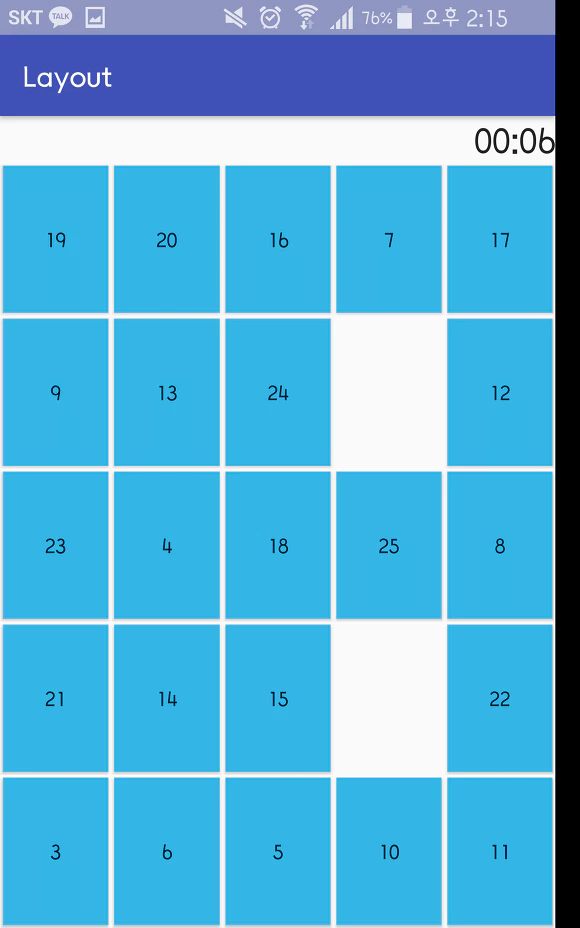

# Layout

리니어 레이아웃(LinearLayout)
---
- 박스모델
- 한쪽 방향대로 차례대로 뷰를 추가하며 화면을 구성하는 방법이다.
- 뷰가 차지할 수 있는 사각형 영역을 할당한다.
- 자유도가 무척 낮다.
- 속성 orientation에서 수평/수직 변경 가능하다.
- 레이아웃 안에 레이아웃을 삽입해서 표처럼 만들수도 있다.

상대 레이아웃(RealativeLayout)
---
- 규칙기반 모델
- 부모 컨테이너나 다른 뷰와의 상대적 위치로 화면을 구성하는 방법이다.

부모 컨테이너와의 위치속성


다른 뷰와의 위치속성
--


응용
---
리니어 레이아웃을 이용해 숫자 빨리누르기 게임을 만들어 보았다.



코드
--
```
package com.example.pc_20.layout;

import android.support.v7.app.AppCompatActivity;
import android.os.Bundle;
import android.view.View;
import android.widget.Button;
import android.widget.Chronometer;

import java.util.ArrayList;
import java.util.Collection;
import java.util.Collections;
import java.util.Random;

public class MainActivity extends AppCompatActivity {
    private Button[] btn_array = new Button[25];
    private Random rd = new Random();
    private ArrayList<Integer> list = new ArrayList<>();
    private Chronometer checkTime = null;
    private int count = 1;

@Override
protected void onCreate(Bundle savedInstanceState) {
    super.onCreate(savedInstanceState);
    setContentView(R.layout.activity_main);

    checkTime = (Chronometer) findViewById(R.id.time);

    for(int i = 0 ; i<btn_array.length; i++) {
        //버튼 ID 한번에
        final int btnID = getResources().getIdentifier("btn" + (i + 1), "id", "com.example.pc_20.layout");
        btn_array[i] = findViewById(btnID);
        list.add(i+1);

        final int finalI = i; //이너클래스 안에 변수넣을때는 반드시 상수여야함
        btn_array[i].setOnClickListener(new View.OnClickListener() {
            @Override
            public void onClick(View v) {
                if( ((Button)v).getText().toString().equals(count+"") ){
                //맞는 숫자를 누르면 숨김
                v.setVisibility(View.INVISIBLE);
                    if(count==2){    
                        checkTime.start();
                    }else if(count==25){
                        //게임 종료
                        checkTime.stop();
                    }
                        count++;
                }
            }
        });
    }
    int index = rd.nextInt(btn_array.length);
    Collections.shuffle(list); //위치 섞음

    for(int i =0; i<btn_array.length;i++){
        btn_array[i].setText(list.get(i)+"");
    }

    }
}
Colored by Color Scripter
cs
```

출처: https://kutar37.tistory.com/60?category=766291 [저장소]
