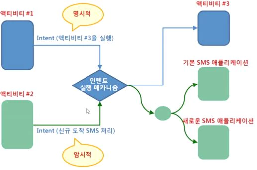
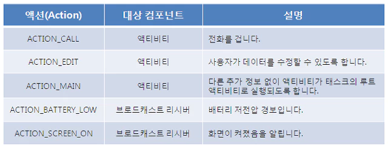
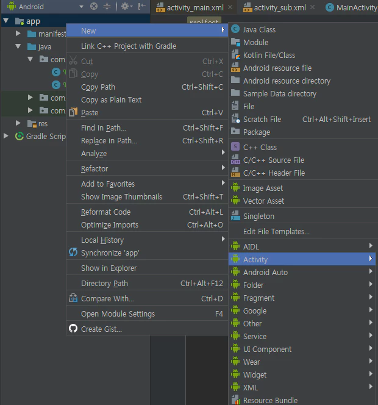
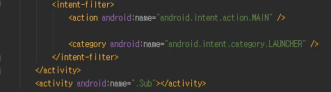
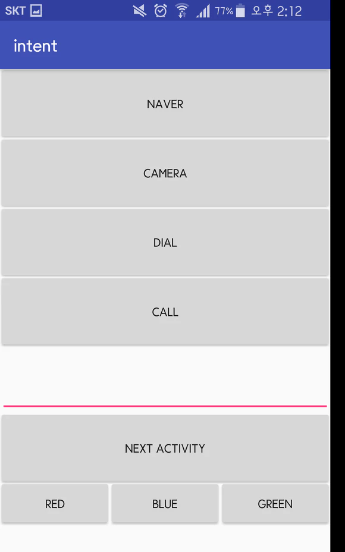

Android의 4대 컴포넌트(component)
--
```
- Activity : 화면에 표시되는 UI 구성을 위해 가장 기본이 되는 요소.
- Service : 앱이 꺼져도 동작하기 위한 컴포넌트로, Background에서 동작 (예: 알람, 멜론 등)
- Boardcast Receiver : 내 폰에서 일어나는 모든 일을 캐치할 수 있게 하는 component
- Content Provider : 어플간 데이터를 주고받게 해준다 (예: 카톡-주소록)

Intent 는 이 component들의 중간다리라고 할 수 있다.
```
- 호출요구 :
    액션 + 데이터
    Activity A -> Activity B
    ~
- 결과값 반환 :
  결과(선택적)을 돌려받음
  Activity A <- Activity B
  
ex) 카톡에서 사진을 보내기 위해 갤러리로 들어가서 사진을 갖고 다시 카톡창으로 돌아올 수 있다.

Intent의 종류
--
  명시적 인텐트 : 타겟 컴포넌트의 이름을 지정
  암시적 인텐트 : 타겟 컴포넌트의 이름을 지정하지 않음 (카메라를 실행할때 어떤 앱으로 실행할지 물어보는 등)

Intent 해석과정
--
  
암시적Intent는 중간에 system을 경유하는 차이다.

암시적 Intent
--
  

한번만 쓰고 버리거나 데이터를 주고받을 필요 없이 혼자 일하는 버튼은 변수를 만들필요 없이 이렇게 할 수 있다
//데이터를 가져온다거나 하는게 아니니까 그냥 이렇게하면 됨
```
findViewById(R.id.btn_naver).setOnClickListener(new View.OnClickListener() {
@Override
public void onClick(View v) {

}
});
```
```
암시적인텐트 예제 :

버튼달아 네이버 이동하기

findViewById(R.id.btn_naver).setOnClickListener(new View.OnClickListener() {
@Override
public void onClick(View v) {
    Intent it_view = new Intent(Intent.ACTION_VIEW, Uri.parse("http://www.naver.com";)); // 암시적 인텐트
    startActivity(it_view);
}
});
```

카메라 실행
--
```
findViewById(R.id.btn_camera).setOnClickListener(new View.OnClickListener() {
@Override
public void onClick(View v) {
Intent intent = new Intent(MediaStore.ACTION_IMAGE_CAPTURE);
startActivity(intent);
}
});
```

다이얼
---
```
findViewById(R.id.btn_dial).setOnClickListener(new View.OnClickListener() {
@Override
public void onClick(View v) {
Intent intent = new Intent(Intent.ACTION_DIAL);
startActivity(intent);
}
});
```
전화걸기 : Permission이 필요하다
Wifi, 전화걸기, 연락처사용, 인터넷 다이렉트접속(앱 내에서) 등의 행위에는 permission이 선행되어야 한다.
```
findViewById(R.id.btn_call).setOnClickListener(new View.OnClickListener() {
@Override
public void onClick(View v) {
Intent intent = new Intent(Intent.ACTION_CALL, Uri.parse("tel:01033091118"));
if (ActivityCompat.checkSelfPermission(MainActivity.this, Manifest.permission.CALL_PHONE) != PackageManager.PERMISSION_GRANTED) {
ActivityCompat.requestPermissions(MainActivity.this, new String[]{Manifest.permission.CALL_PHONE}, 0);
return;
}
startActivity(intent);
}
});

위 코드를 작성하면 에러가 나는데 : 자동완성으로 AndroidManifest.xml 에 permission을 위한  
<uses-permission android:name="android.permission.CALL_PHONE"/>
을 추가한다.
```
명시적인텐트
---
새 액티비티 만들기:
app 오른쪽클릭- new - Activity
  

메인화면 바꾸기:
AndroidManifest.xml 들어가서
<intent-filter>를 옮긴다.
  


다음페이지 넘기기

findViewById(R.id.btn_next).setOnClickListener(new View.OnClickListener() {
@Override
public void onClick(View v) {
startActivity(new Intent(MainActivity.this, Sub.class));
}
});

다음페이지에서 다시 돌아오기
```
Sub.java
findViewById(R.id.btn_main).setOnClickListener(new View.OnClickListener() {
@Override
public void onClick(View v) {
startActivity(new Intent(Sub.this, MainActivity.class));
}
});
```
이렇게하면 뒤로가기를 통해 이전 페이지로 다시 돌아올 수가 있다.
그러나 FILO (First In Last Out) 구조기 때문에, 메인에서 뒤로가기를 누르면 우리가 생각한 것처럼 앱이 종료되지 않고
버튼을 눌렀던 만큼 뒤로가기가 된다. (이 스택하나를 Task라고 한다.)

그래서 뒤로갈때는 finish()를 사용해서 자기 스스로 스택에서 빠지게 하게 한다.
```
findViewById(R.id.btn_main).setOnClickListener(new View.OnClickListener() {
@Override
public void onClick(View v) {
finish();
}
});
```
텍스트 가지고 이동하기
```
findViewById(R.id.btn_next).setOnClickListener(new View.OnClickListener() {
@Override
public void onClick(View v) {
Intent intent = new Intent(MainActivity.this, Sub.class);
intent.putExtra("txt",textBox.getText().toString());
startActivity(intent);
}
});
```
  


출처: https://kutar37.tistory.com/61?category=766291 [저장소]
